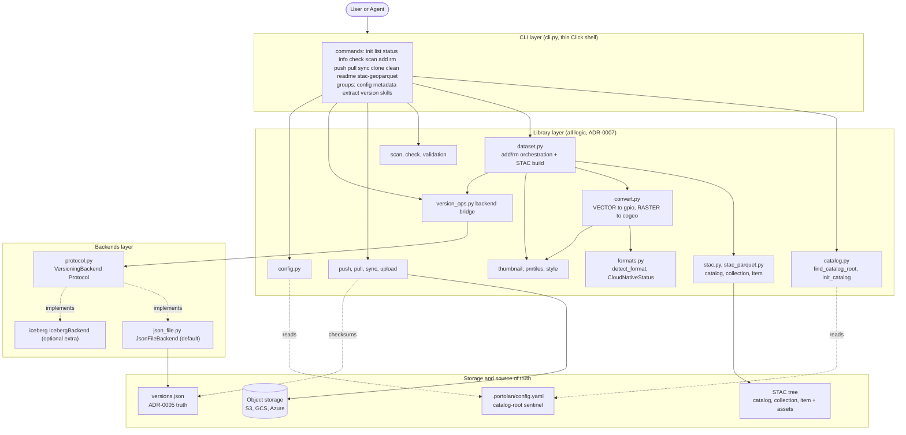

---
paths:
  - "portolan_cli/**/*.py"
---

# Architecture mindmap (read this first when navigating the code)

Portolan is a thin Click shell over a fat library, with a pluggable versioning
backend underneath (ADR-0007 CLI-wraps-API, enforced by import-linter, ADR-0025).
Use this map to find where a behavior lives before you start editing. Line
numbers drift, treat them as a starting point and confirm in the file.

## The layers and how a command flows down them

## Command surface (entry point cli.py)

`portolan_cli/__init__.py` re-exports `cli` from `cli.py`, where the Click group
and every command live. Top-level commands: `init`, `list`, `status`, `info`,
`check`, `scan`, `add`, `rm`, `push`, `pull`, `sync`, `clone`, `clean`,
`readme`, `stac-geoparquet`. Command groups with subcommands: `config`
(set/get/list/unset), `metadata` (init/validate), `extract` (arcgis/wfs),
`version` (current/list/bump/rollback/prune), `skills` (list/show). When you add
or rename a command, the AST in `scripts/validate_claude_md.py` re-reads these
decorators, so the root `CLAUDE.md` command references must stay accurate.

## Library layer (ADR-0007: all logic lives here, never in cli.py)

`cli.py` parses flags, resolves the catalog root, loads `.env`, and delegates.
The big orchestrators are `dataset.py` (add/rm, the largest module, drives STAC
build + conversion + versioning), `push.py`/`pull.py`/`sync.py` (remote I/O),
`scan*.py` + `check.py` + `validation/` (discovery and validation), and
`version_ops.py` (the only bridge from the library to a backend). See the
subsystem table below and the path-scoped rules for each.

## Backends layer and protocol fidelity (ADR-0003, ADR-0005, ADR-0046)

- `backends/protocol.py` defines `@runtime_checkable class VersioningBackend`
  with `get_current_version`, `list_versions`, `publish`, `rollback`, `prune`,
  `check_drift`. `backends/__init__.py` `get_backend(name)` is the factory,
  `"file"` -> `JsonFileBackend` (always available), `"iceberg"` ->
  `IcebergBackend` (needs the `[iceberg]` extra). The CLI reaches a backend only
  through `version_ops.py`, which resolves the name CLI flag > config > `"file"`.
- **Optional hooks are duck-typed, NOT in the Protocol.** `on_post_add`, `pull`,
  `supports_push`, `push_blocked_message` are checked via `hasattr`. If you add
  one, document it in `protocol.py`, do not widen the Protocol.
- `PostAddContext.collection` is typed `Any` on purpose, to avoid a hard `pystac`
  import in `protocol.py`. Do not add a pystac import there.
- The file backend is **single-writer** and not thread-safe, it relies on drift
  checking, not locking. Concurrency safety is an Iceberg-only property.
- Import contracts (`uv run lint-imports`): `cli` must not import `backends`
  (only `backends.protocol` under `TYPE_CHECKING`), `backends.iceberg` must not
  import `cli`.

## Format detection and conversion routing (formats.py, convert.py)

Two enums in `formats.py`: `CloudNativeStatus` (`CLOUD_NATIVE` / `CONVERTIBLE` /
`UNSUPPORTED`) and `FormatType` (`VECTOR` routes to geoparquet-io, `RASTER`
routes to rio-cogeo, `UNKNOWN`). `CLOUD_NATIVE_EXTENSIONS` is the source of truth
for "already cloud-native, skip conversion" (`.fgb`, `.pmtiles`, `.raquet`,
while `.parquet`/`.tif` need content inspection). `convert.py` orchestrates only
(ADR-0010): `CLOUD_NATIVE` -> SKIPPED, `UNSUPPORTED` -> returned with no error
(ADR-0014, accept with a warning), else route by `detect_format` to
geoparquet-io or rio-cogeo. Never put geometry or raster math in our layer.

## Source-of-truth model

- `versions.json` is the single source of truth for versions, checksums, sync
  state, and history (ADR-0005). It lives at `{catalog_root}/{collection}/`
  (collection-level, ADR-0023).
- `.portolan/config.yaml` is the **only** catalog-root sentinel (ADR-0027/0029).
  `find_catalog_root` walks up looking for it, `detect_state` returns MANAGED
  only when it exists, and `init_catalog` writes it LAST for atomicity. Do not
  reintroduce a `state.json` sentinel.
- The STAC tree (`catalog.json`, `collection.json`, `item.json`, assets) is what
  gets published. It is SELF_CONTAINED with relative links (ADR-0051).

## Subsystem map (which module owns what, and its rule)

| Subsystem | Modules | Path-scoped rule |
|-----------|---------|------------------|
| CLI shell + agent contract | `cli.py`, `output.py`, `json_output.py`, `errors.py`, `validation/`, `*_progress.py` | `cli-and-output.md` |
| Catalog / STAC build | `catalog.py`, `stac.py`, `dataset.py`, `stac_parquet.py`, `collection.py`, `item.py`, `models/` | `stac-assets.md` |
| Format detect + convert + viz | `formats.py`, `convert.py`, `crs.py`, `pmtiles.py`, `partitioning.py`, `thumbnail.py`, `style.py` | `conversion-and-visualization.md` |
| Sync / remote | `push.py`, `pull.py`, `sync.py`, `upload.py`, `download.py`, `async_utils.py` | `sync.md` |
| Scan / check / metadata | `scan*.py`, `check.py`, `metadata/`, `clean.py` | `scan-check.md` (the four `metadata/{cog,geoparquet,pmtiles,flatgeobuf}.py` format extractors also load `conversion-and-visualization.md`) |
| Versioning backends | `backends/`, `version_ops.py`, `versions.py` | this file + `stac-assets.md` |
| Extract / harvest | `extract/` (only `arcgis` and `wfs` are wired commands, `csw/` is a module dir not yet exposed as a subcommand) | (reuse `extract/common/`, mock network in tests) |
| Config / leaf utils | `config.py`, `constants.py`, `utils.py` | `python.md` (conventions, import contracts) |

## Where to investigate further

- `pyproject.toml` `[tool.importlinter]` for the exact contracts, and ADR-0025.
- ADRs 0003, 0005, 0007, 0010, 0014, 0023, 0027, 0029, 0046, 0051.
- The per-subsystem rules in the table above for the gotchas in each area.
