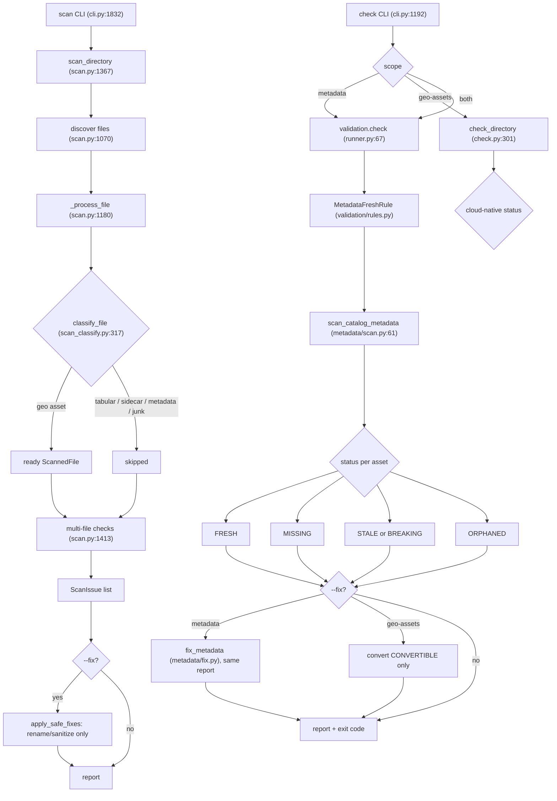

---
paths:
  - "portolan_cli/scan.py"
  - "portolan_cli/scan_classify.py"
  - "portolan_cli/scan_detect.py"
  - "portolan_cli/scan_fix.py"
  - "portolan_cli/scan_infer.py"
  - "portolan_cli/scan_output.py"
  - "portolan_cli/check.py"
  - "portolan_cli/clean.py"
  - "portolan_cli/metadata/**"
---

# Scan, check, and metadata freshness

Two related pipelines live here. `scan` discovers and classifies files and
reports issues (read-only by default). `check` validates the catalog, including
STAC metadata freshness, and with `--fix` reconciles it. They have a long bug
history around **reporting problems that `--fix` cannot resolve** and
**mistaking collection-level rollup assets for missing items**. The rules below
are what keep the two halves in agreement.

## The flow

## The STAC manifest is the canonical scan source for freshness (ADR-0041)

`check --metadata` and `check --metadata --fix` MUST consume the **same**
`scan_catalog_metadata(catalog_path)` (`metadata/scan.py`). It walks the STAC
**manifest tree** (catalog -> collection.assets -> item dirs), not a filesystem
extension glob. Do not reintroduce a parallel filesystem-walk scanner, that is
exactly what produced the bug where `check` reported MISSING for files `--fix`
never saw, and `--fix` then said "already fresh" forever (issues #345, #384).

## The five statuses, and which are auto-fixable

`MetadataStatus` is FRESH / MISSING / STALE / BREAKING / ORPHANED.

- **FRESH**: registered, mtime unchanged or heuristics equal. `--fix` skips it.
- **MISSING**: registered in STAC but the file is gone, or an item dir whose data
  file exists but `item.json` does not. `--fix` creates the item. Counts as an
  ERROR.
- **STALE / BREAKING**: mtime changed and bbox/feature-count heuristics changed
  (STALE), or the schema fingerprint changed (BREAKING). `--fix` updates the item
  and versions tracking. BREAKING is an ERROR, STALE is part of the freshness
  message.
- **ORPHANED**: a data file on disk under a collection that is not registered in
  any manifest. Reported as a WARNING and **explicitly not auto-fixable**, `--fix`
  SKIPS it with a message rather than fabricating a wrong `item.json`.

The invariant: **`check` must never report an issue that `--fix` cannot
resolve.** It holds structurally because both paths read the same
`MetadataReport`, and the non-fixable cases (ORPHANED, collection-level assets)
are reported but marked SKIPPED. If you add a new status or rule, preserve this,
either make it fixable or mark it clearly non-fixable in both halves.

## Collection-level assets are NOT items (ADR-0031)

A registered collection-level asset (e.g. `items.parquet`, or an ADR-0031 single
vector file) has no companion `item.json`. Freshness-check it against
`versions.json` directly (`_check_collection_level_asset`), never route it
through the per-file item-JSON lookup, or it falsely reports MISSING. In
`fix_metadata`, STALE/BREAKING on a collection-level asset is SKIPPED with a
"re-run portolan add" message (regenerating it is `add`'s job, not `check`'s).

## mtime + heuristics fast gate (ADR-0017)

Freshness uses a cheap gate before any expensive hashing. stored mtime is None
means new. mtime unchanged means FRESH (fast path). mtime changed then compare
schema fingerprint (BREAKING) and bbox/feature-count heuristics (STALE), and if
those are equal it is touched-but-unchanged, so FRESH. The fast path requires
mtime within tolerance **and** size unchanged, a fast `convert + mv` otherwise
looks unchanged and gets wrongly skipped.

## scan `--fix` sanitizes names, it does NOT convert formats

`scan --fix` (`apply_safe_fixes`) only renames and sanitizes: lowercase, spaces
to dashes (including the extension), Windows reserved names get an underscore
prefix, long paths get hash-truncated, invalid collection ids get fixed. It is
gated to the FIX_FLAG set. **Format conversion is exclusively
`check --fix --geo-assets`** (vectors to GeoParquet, rasters to COG via
`convert_directory`, only `CONVERTIBLE` files). Keep these separate (ADR-0016
scan-before-import). Shapefile renames move all sidecars together with rollback.

## Classification and discovery gotchas

- A FileGDB `.gdb` directory is one asset, yielded whole and not recursed into.
- Shapefile sidecars (`.dbf`/`.shx`/`.prj`/...) are tracked then skipped, never
  imported directly. An incomplete shapefile (missing `.dbf`/`.shx`) is an ERROR.
- A `.parquet` with no `geo` schema-metadata key is tabular, not GeoParquet, skip
  it as `TABULAR_DATA`/`NOT_GEOSPATIAL` (RULE-0030).
- An image under 1 MiB is a thumbnail, larger images are raster data.
- Catalogs reach 25k+ item dirs. Any per-directory or per-asset check must be
  O(n), the `_check_mixed_structure` O(n^2) bug hung for minutes on 27k dirs.
  Read bbox and counts from file metadata (O(1)), never parse geometry.
- Detect Hive partitions by the `key=value/` pattern and strip those segments
  before inferring a collection id (see `conversion-and-visualization.md`).

## `--geo-assets` is a different check

`check --geo-assets` (`check_directory`) classifies each geospatial file as
`CLOUD_NATIVE` / `CONVERTIBLE` / `UNSUPPORTED` via `get_cloud_native_status`.
This is "is each asset already cloud-native", distinct from the STAC validation
rules in `validation/`. `--remove-legacy` requires `--fix` and deletes only the
sources of successful conversions whose output exists, plus their sidecars.

## Where to investigate further

- ADRs 0016 (scan before import), 0017 (mtime heuristics), 0034 (statistics),
  0035 (temporal extent), 0041 (manifest canonical).
- `metadata/scan.py` module docstring, it spells out the MISSING/ORPHANED split.
- The validators in `portolan_cli/validation/` and `spec/schema/rules.yaml`.
  Note: the mapping from a CLI rule class to a `RULE-id` is by convention and
  description, there is no `implemented_by` field linking them in code.
