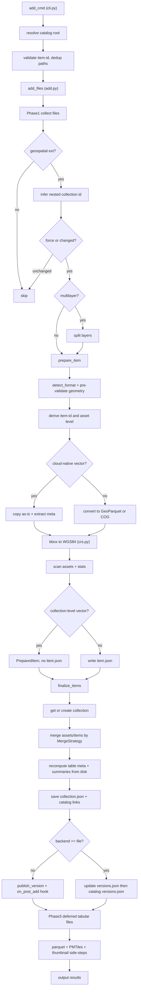

---
paths:
  - "portolan_cli/stac.py"
  - "portolan_cli/stac_parquet.py"
  - "portolan_cli/add.py"
  - "portolan_cli/query.py"
  - "portolan_cli/remove.py"
  - "portolan_cli/catalog.py"
  - "portolan_cli/collection.py"
  - "portolan_cli/collection_id.py"
  - "portolan_cli/item.py"
  - "portolan_cli/models/**"
---

# STAC construction and asset wiring

This is the **highest-churn bug area in the repo.** The same handful of mistakes
(asset key/href shape, collection-vs-item placement, pystac path leaks,
overwrite-on-re-add) have been fixed, reverted, and re-fixed many times. Read
this before touching any module that writes `catalog.json`, `collection.json`,
`item.json`, or asset entries.

The canonical spec for everything below lives in this repo under `spec/` (the
`portolan-spec` GitHub repo is a read-only mirror, ADR-0048). The
machine-readable rule matrix is `spec/schema/rules.yaml` (RULE-0001..RULE-0095).
The CLI validators in `portolan_cli/validation/` must satisfy it, so when you
change STAC output, check the relevant RULE-id there.

## The `add` flow (where each artifact is written)

`item.json` is written per item during preparation, but `collection.json`,
`versions.json`, and the parent `catalog.json` links are written **once per
collection** in `finalize_items`, so a prep failure leaves no version entry.

## Asset keys vs hrefs are NOT the same shape (RULE-0010 / RULE-0011)

This asymmetry is the single most repeated bug. Get it exactly right.

- **Asset key** is collection-relative and MUST NOT repeat the collection dir
  name. Single file `tunnels.parquet`. With items `districts/districts.parquet`.
- **Asset href** is catalog-root-relative and MUST include the collection dir.
  e.g. `tunnels/tunnels.parquet`, `boundaries/districts/districts.parquet`.
- The classic failure is using `tunnels/tunnels.parquet` (or worse,
  `tunnels/tunnels/tunnels.parquet`) as the **key**. Path doubling like
  `collection/collection/data.parquet` is the same bug surfacing in the href.

Derive collection-level asset keys from the **file stem** (`census.parquet` ->
`census`), never a hardcoded literal like `"data"`. Multiple vector assets in one
collection all keyed `"data"` silently overwrite each other.

Before inserting an asset, scan **all** existing assets for one whose resolved
href already matches and reuse that key, so you preserve human-authored keys
instead of generating a duplicate. (See `add_asset_to_collection` in `stac.py`.)

## Single-file vector data is a COLLECTION-level asset, not an item (ADR-0031, RULE-0042)

- A single GeoParquet / Shapefile / GeoPackage file sitting directly in a
  collection dir becomes an entry in `collection.json["assets"]`. Do **not**
  create an item subdir or `item.json` for it. Tests assert the *absence* of
  `item.json` for these.
- Items exist only for **multiple files**: partitioned vectors (one item per
  Hive partition) and raster mosaics. Rasters (COG/GeoTIFF) are item-level.
- `.gdb` (FileGDB) is a directory but is **one** logical asset. Treat it like a
  single file everywhere you enumerate, scan, status, add, collection-id
  inference. Strip the `.gdb`/dot from the name before deriving a collection id
  (a dot is an invalid collection-id char).
- Asset-type allow-lists in scanners must include **all** ADR-0031 vector
  formats, not just parquet/raster/pmtiles, or `.gpkg`/`.shp` collection assets
  get silently dropped and skip freshness/ORPHANED validation.

## `add` MERGES, it never regenerates (ADR-0038, MergeStrategy in stac.py)

Re-running `portolan add` on an existing collection must not wipe human metadata
or double-count machine metadata. This caused repeated data-loss bugs.

- **Preserve human-enrichable fields**: `asset.title`, `asset.description`,
  `table:columns[].description`, collection `description`, `providers`,
  `license`, `links`, `portolan:styles`.
- **Only update machine-derivable fields**: `href`, `type` (media type),
  `roles`, `table:row_count`, column `name`/`type`, `proj:epsg`,
  `extent.bbox`, summaries. These travel under known prefixes
  (`file:`, `proj:`, `pmtiles:`, `flatgeobuf:`, `raster:`, `portolan:`).
- **Recompute from disk, do not carry forward aggregates.** Re-read parquet
  metadata from the files actually tracked in `collection.assets`
  (`_collect_parquet_metadata_from_disk`). Carrying the prior collection-level
  `row_count` into the new sum double-counts, counting untracked parquet inflates
  it.
- For `table:row_count` on re-add use prior OR new, never prior + new.
- Detect and fully replace the whole-world placeholder bbox
  `[-180, -90, 180, 90]`, never let it survive as the real extent.
- Honor `merge_strategy` (`smart` default, `keep`, `overwrite`, and `interactive`
  which is defined but not yet implemented) on **both** item-level and
  collection-level extent/asset updates, not just one.

## pystac leaks absolute paths and mis-detects dirs (known-issues/pystac-absolute-paths.md, ADR-0051)

The catalog type is SELF_CONTAINED, all `root`/`self`/`parent`/`child` links MUST
be relative, no leading `/`, no `file://`, no `C:\`, no URI scheme (RULE-0040).
pystac fights this in two ways.

- **Absolute-path leak.** `to_dict()`/`save()` can emit absolute local paths.
  Prefer manual JSON construction for link hrefs, and post-verify that no
  absolute filesystem path landed in the output.
- **Trailing-slash dir detection.** `normalize_hrefs()` treats a final path
  segment containing a dot (e.g. a `mktemp` dir like `tmp.xyz`) as a *file* and
  writes `catalog.json` into the parent dir. **Every** `normalize_hrefs()` call
  MUST pass a trailing slash: `catalog.normalize_hrefs(f"{path}/")`.
  `set_self_href` does not protect you, it gets overwritten.

## STAC v1.1.0 conventions (RULE matrix + models/_stac_version.py)

- Generate STAC **v1.1.0**. Use the `STAC_VERSION` constant from
  `models/_stac_version.py` / `stac.py` everywhere. **Never hardcode `"1.0.0"`**
  in serialization (this regressed in `models/catalog.py`).
- Raster band metadata (`bands`, formerly `raster:bands`) goes on the **data
  asset**, never on `item.properties`. Declare the raster extension.
- A collection MUST declare every extension its items use. After building
  summaries, call `build_stac_extensions()` and merge the result into the
  collection's `stac_extensions` (it exists but has been forgotten for
  collections). When STAC output changes, update the fixtures under
  `tests/fixtures/metadata/stac/**` in the **same** change so snapshot/compliance
  tests still compare like-for-like.
- Parquet media type is `application/vnd.apache.parquet` (RULE), never
  `application/x-parquet`. PMTiles is `application/vnd.pmtiles`.
- Tabular (non-geo) collections MUST set `portolan:geospatial: false`
  (RULE-0090, ADR-0047). Absent or true means full spatial requirements apply.
  A `.parquet` with no `geo` schema-metadata key is NOT GeoParquet (RULE-0030),
  route it to the tabular pipeline.

## `add` must be atomic

Validate the file (geometry, bbox, CRS) **before** any filesystem mutation, or
stage in a temp dir and atomically move. A failed `add` must leave no item dir,
no copied file, and no `versions.json` entry. Phantom assets in `versions.json`
from a failed generation step are a recurring complaint.

## Catalog root detection is centralized

Every command finds the catalog root through the single `find_catalog_root()` in
`catalog.py`, whose only sentinel is `.portolan/config.yaml` (ADR-0027/0029).
Never re-implement root detection locally, divergent logic produces "shadow
catalogs" where `add` succeeds but `list`/`status` see nothing. Do not
reintroduce a `state.json` sentinel.

## The meta-rule for this whole area: fix every parallel call site

The biggest single cause of regressions here is fixing the path in the traceback
and missing its twin. The pystac trailing-slash fix shipped for `init_catalog`
but missed two sites in `add.py`, the asset-key fix shipped for one format
and missed the others. **After any fix in this area, grep the repo for the
function/pattern (`normalize_hrefs(`, `add_asset_to_collection`,
`STAC_VERSION`, the media-type string) and confirm every caller is covered.**
Pair the fix with a regression test that fails before and passes after.

## Where to investigate further

- `spec/structure.md`, `spec/core.md`, `spec/versions.md`,
  `spec/formats/vector.md`, `spec/schema/rules.yaml` (the RULE-ids cited above).
- ADRs 0028 (all files as assets), 0031 (collection-level vector assets),
  0032 (nested catalogs, flat collections), 0038 (metadata.yaml enrichment),
  0041 (STAC manifest canonical), 0047 (tabular), 0051 (SELF_CONTAINED).
- `context/shared/known-issues/pystac-absolute-paths.md`.
- Tests: `tests/integration/test_add_*`, the STAC snapshot/compliance tests.
