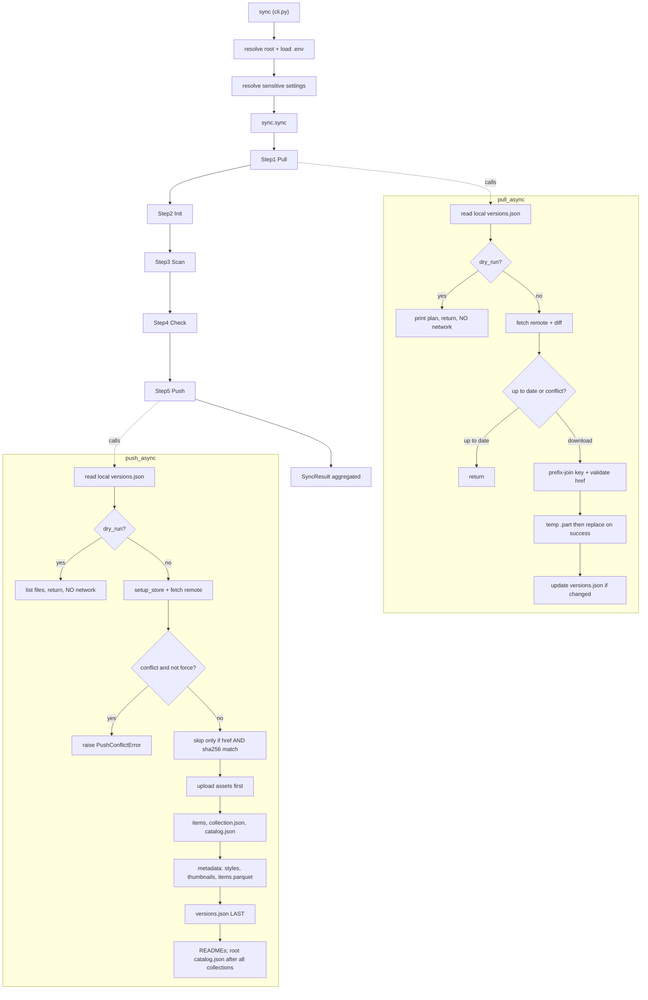

---
paths:
  - "portolan_cli/push.py"
  - "portolan_cli/pull.py"
  - "portolan_cli/sync.py"
  - "portolan_cli/upload.py"
  - "portolan_cli/upload_progress.py"
  - "portolan_cli/download.py"
  - "portolan_cli/async_utils.py"
---

# Sync and remote I/O (push, pull, sync, upload, download)

This subsystem moves a catalog to and from object storage (S3, GCS, Azure). It
has a long history of two bug classes: **silently dropping files that should
sync**, and **doing real I/O when it should not** (dry-run, diffing). Portolan
**owns** the bucket contents (ADR-0006), so a partial or wrong push corrupts the
authoritative copy. `versions.json` is the single source of truth and the sync
manifest (ADR-0005).

## The flow (sync orchestrates pull and push)

The dry-run and diffing gates live **inside** pull and push, `sync` only threads
`dry_run`/`force` through the five steps.

## `push` syncs the WHOLE catalog, not just versioned data assets

The recurring bug: `push` uploads only `versions.json`-tracked data assets and
silently omits everything else. Each new artifact type (styles, thumbnails,
READMEs, `items.parquet`) shipped, then needed a follow-up fix to actually get
uploaded.

- Push uploads the full catalog: every `catalog.json`, `collection.json`, root
  `README.md`, collection READMEs, root and per-collection `versions.json`,
  `style.json` / `styles/*`, thumbnails, `items.parquet`. (`llms.txt` is a spec
  MUST per ADR-0052 but is NOT generated by the CLI yet, do not assume push
  ships it until generation lands.)
- The upload set is driven by a default sync with a `push.exclude` glob list in
  `config.py`, **not** a hand-maintained allowlist. When you add any new
  generated artifact, confirm it is covered by the default sync and not silently
  skipped. Verify the push -> clone round-trip, `clone` needs `catalog.json` at
  the remote root.
- Security excludes in `push.py` (`.env`, `.git/`, `.portolan/`, the
  `_SECURITY_EXCLUDE_PATTERNS`) are always enforced and cannot be overridden by
  user config.

## `push` diffs against the remote, it does not re-upload everything

`versions.json` stores **complete snapshots** (ADR-0005), so naively uploading
"every asset in the current version" tries to push all 3000 files when you added
one. Diff by sha256 against the remote `versions.json` and upload only new or
changed assets. (See `_get_assets_to_upload` in `push.py`.)

## Discovery recurses, nested catalogs exist (ADR-0032)

Collection discovery must `rglob("versions.json")` (skipping `.portolan/`) so a
catalog-wide push reaches sub-catalogs at any depth. A flat
`catalog_root/*/versions.json` check misses nested collections.

## Publish ordering is atomic, manifest LAST

- Upload root and catalog metadata (`catalog.json`, root README) **only after
  all collection tasks succeed.** Do not hardcode `include_catalog=True` per
  collection, a later failure then leaves the remote root pointing at an
  incomplete catalog.
- Within a collection, upload `versions.json` **last** (manifest-last
  atomicity, ADR-0005), so a reader never sees a manifest referencing
  not-yet-uploaded bytes.

## Dry-run does NO network I/O

`pull(dry_run=True)` and `push(dry_run=True)` must return **before** any network
call (`_fetch_remote_versions`, `_setup_store`). Read only local `versions.json`.
`sync.py` just threads `dry_run` through, the gate belongs in push/pull. Tests
must assert the network functions are never called (`TestDryRunNetworkIsolation`).
The dry-run summary counts must match the files it lists, no "Would push N" then
"Nothing to push".

## Pull must never destroy the last good local copy

- Download to a **temp file** and `os.replace()` only on success. Never `unlink`
  the existing target before the new bytes are durably written, a transient
  network failure otherwise deletes good data.
- Carry the resolved remote **prefix** through to asset URL construction. The
  manifest is read from `catalog/<collection>/versions.json` but asset download
  must not throw the `catalog` prefix away and fetch the bare `href`, every
  asset fails on a prefixed remote otherwise.

## URL and path hygiene

- `parse_object_store_url()` must strip trailing slashes from the prefix for
  **all three** providers, or you get `prefix//collection/versions.json`.
- Reject absolute paths and path traversal on remote keys and agent-supplied
  inputs (`pull.py` already rejects absolute paths). Validate through
  `validation/input_hardening.py`.
- When comparing a filesystem path to a STAC href, normalize to POSIX
  (`PurePath(...).as_posix()`), never raw `str()` of a relative path, backslashes
  on Windows break href matching.

## Async correctness (async_utils.py)

- **Stream** files (path-based or chunked) in async upload/download. Do not
  `read_bytes()` whole assets into memory under concurrency, 27k-item catalogs
  OOM otherwise.
- No O(n^2) work. Catalogs reach 25k+ item dirs and 60M+ rows, use dict lookups,
  not per-item linear scans, for size/queue computation.
- **Concurrency fans out multiplicatively.** Effective connections are
  `file_concurrency x chunk_concurrency x workers`. Keep defaults modest (cloud
  SDKs use single digits per client), include `workers` in any connection
  footprint warning, and place the warning after the worker count resolves.
  Provide a way to scale down, not only up. Do not advertise a flag like
  `--adaptive` in help unless it is actually wired to the executor.

## Credentials never live in config.yaml (ADR-0024)

Sensitive settings (`remote`, `profile`/`aws_profile`, `region`) come from env
vars (`PORTOLAN_REMOTE`, `PORTOLAN_PROFILE`, ...) or `.env`, never `config.yaml`,
because `config.yaml` itself gets pushed to the public remote. Resolve the
catalog root **first**, then load `.env`/config for that root, so a `--catalog B`
run never uses catalog A's credentials. Precedence is CLI > env > config.

## `sync` is the full pipeline

`sync` orchestrates Pull -> Init -> Scan -> Check -> Push. Do not describe or
simplify it as "pull + push" in code, docstrings, or docs.

## Where to investigate further

- ADRs 0005 (versions.json source of truth), 0006 (remote ownership),
  0024 (hierarchical config), 0030 (agent-native input hardening),
  0032 (nested catalogs).
- `spec/versions.md`, `spec/schema/rules.yaml` (RULE-0010..0015 for versions.json
  shape, RULE-0050..0052 for required files).
- Tests: `tests/network/`, the `TestDryRunNetworkIsolation` classes in
  `test_push`/`test_pull`/`test_sync`.
