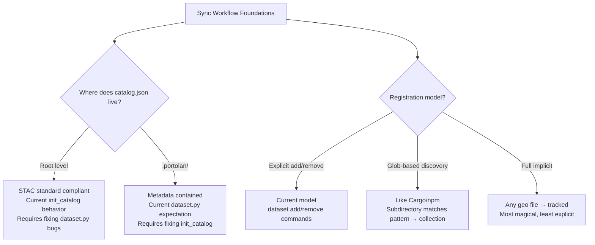

# Scope: sync-workflow-foundations

## Current Focus
> Tier 1 foundational decisions: catalog.json location (Issue #94) and git-style implicit tracking model

---

## Research Summary

### Codebase Context

**RESOLVED: Location Inconsistency Bug (ADR-0023)**

These bugs have been fixed per ADR-0023:
- ~~`_update_catalog_links()` reads from **`.portolan/catalog.json`**~~ ✓ Fixed: root level
- ~~`list_datasets()` looks for **`.portolan/catalog.json`**~~ ✓ Fixed: root level
- ~~`remove_dataset()` reads from **`.portolan/catalog.json`**~~ ✓ Fixed: root level

All STAC files now at root level, only internal state in `.portolan/`.

**Current Registration Model: Explicit**
- `portolan dataset add <file> --collection <name>` — explicit registration
- Collections created on-demand when first item added
- No implicit discovery of subdirectories or files
- `versions.json` tracks checksums/versioning (per ADR-0005)

**Key Files:**
- `portolan_cli/catalog.py` — init, state detection
- `portolan_cli/dataset.py` — add/remove orchestration (contains the bugs)
- `portolan_cli/stac.py` — STAC helpers

**State Detection (detect_state()):**
- MANAGED: has `.portolan/` AND root `catalog.json`
- UNMANAGED_STAC: has root `catalog.json` only
- FRESH: neither

### Domain Research

**STAC Convention for catalog.json:**
- **Best practice**: Root-level `catalog.json` at directory root
- **Analogy**: Like `index.html` for websites
- **Tooling expectation**: PySTAC, STAC Browser expect root-level
- **Not normative**: Subdirectory possible but non-standard, may break tools

**Key Sources:**
- STAC Best Practices doc (incorporated v0.7.0)
- PySTAC `BestPracticesLayoutStrategy`
- STAC-spec Issue #925 (Catalog vs Collection as root)

**Git-Style Tracking — Common Misconception:**
- Git itself uses **EXPLICIT** tracking (`git add` required)
- "Implicit" pattern is actually **glob-based discovery** (Cargo, npm)

**Relevant Prior Art:**

| Pattern | Tools | How It Works |
|---------|-------|--------------|
| Explicit manifest | Git, Terraform | `add` command required |
| Glob-based discovery | Cargo, npm, pnpm | Matches glob → tracked |
| Full implicit | Docker Compose | Presence in file → tracked |

**Cargo/npm Pattern (Most Relevant):**
```toml
[workspace]
members = ["packages/*"]  # Glob defines scope
exclude = ["packages/experimental"]  # Opt-out
```
- Presence in matched path = tracked
- Removal: delete OR add to exclude
- No explicit `add` command needed

---

## Decision Tree



---

## Task Decomposition
*[Tasks emerge from dialogue—not auto-generated]*

---

## Dependency Order
*[What depends on what, implementation sequence]*

---

## Happy Path
*[Straight-line success case, minimal complexity]*

---

## Edge Cases
| Scenario | Expected Behavior | Notes |
|----------|-------------------|-------|
| *TBD* | | |

---

## Resolved Assumptions
| Assumption | Decision | Rationale |
|------------|----------|-----------|
| catalog.json location | Root level (`./catalog.json`) | STAC standard; tools expect it |
| collection.json location | In user's directory (`demographics/collection.json`) | STAC standard; alongside data, not hidden |
| Registration model | Git-style implicit | Top-level subdir with geo files = collection |
| Metadata generation | `check --fix` creates STAC metadata | collection.json, item.json generated on demand |
| `.portolan/` role | Internal tracking only | versions.json, config — not STAC metadata |
| Nested subdirs | Organizational structure within collection | Items can be nested (year/region/file.parquet) |
| Untracking | Delete file | Git-style: remove file = untrack |

---

## Open Questions
1. ~~**catalog.json location**~~ → RESOLVED: Root level
2. ~~**Registration model**~~ → RESOLVED: Git-style implicit
3. **`dataset add/remove` commands**: Deprecate or remove entirely?
4. ~~**Untracking mechanism**~~ → RESOLVED: Delete file
5. ~~**Collection naming**~~ → RESOLVED: Subdirectory name = collection ID

---

## Parking Lot
- Tier 2+ tasks (check command, sync logic)
- Remote sync workflow (push/pull)
- versions.json generation details
