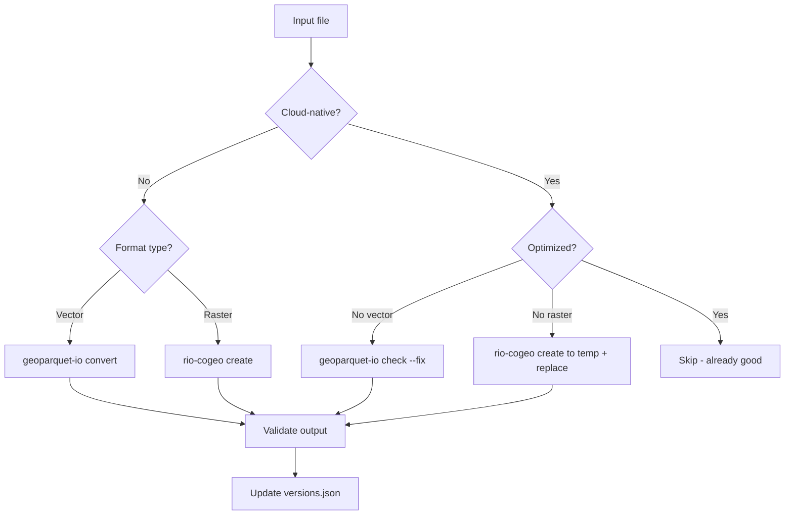
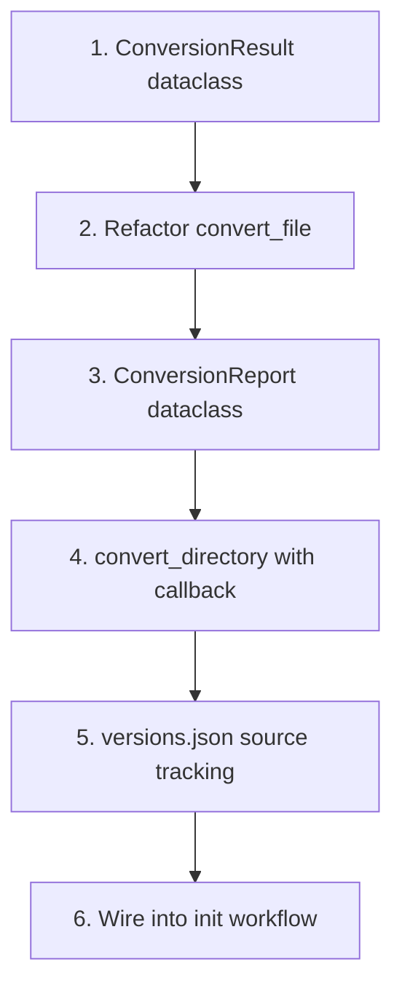
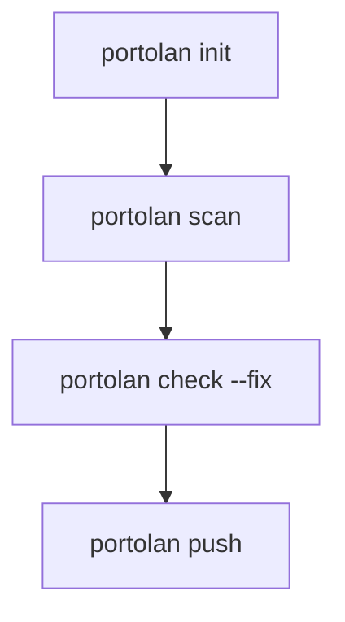

# Scope: convert-command

## Current Focus

> **Phase 3: Architecture Dialogue** -- COMPLETE. Ready for task decomposition.

---

## Research Summary

### Codebase Context

**Existing Infrastructure (80% Complete):**

| Component | Location | Status |
|-----------|----------|--------|
| convert_vector() | portolan_cli/dataset.py:202 | Exists, wraps geoparquet-io |
| convert_raster() | portolan_cli/dataset.py:227 | Exists, wraps rio-cogeo |
| Format detection | portolan_cli/formats.py | Complete 3-tier system |
| Output utilities | portolan_cli/output.py | Standardized messaging |
| JSON envelopes | portolan_cli/json_output.py | Dual output mode ready |
| Metadata extraction | portolan_cli/metadata/ | GeoParquet + COG done |

**Format Classification (from formats.py):**

- CLOUD_NATIVE: GeoParquet, COG, FlatGeobuf, PMTiles, Zarr, COPC
- CONVERTIBLE: Shapefile, GeoJSON, GeoPackage, CSV, JP2, non-COG TIFF
- UNSUPPORTED: NetCDF, HDF5, LAS/LAZ (non-COPC)

**Gaps to Fill:**

1. No standalone convert_file() API function
2. No ConversionResult dataclass
3. No CLI command registration
4. No format-specific error types in errors.py

**Key ADRs:**

- ADR-0007: CLI wraps API (all logic in library layer)
- ADR-0010: Delegate conversion to geoparquet-io/rio-cogeo
- ADR-0014: Accept non-cloud-native with warnings

### Domain Research

**Library APIs:**

| Library | API Pattern | Key Features |
|---------|-------------|--------------|
| geoparquet-io | gpio.read(input).add_bbox().sort_hilbert().write(output) | Fluent API, cloud storage, spatial indexing |
| rio-cogeo | cog_translate(src, dst, profile, in_memory=True) | Profiles (deflate/jpeg/webp), auto-overviews, validation |

**CLI Design Patterns (from GDAL, rio, fio):**

- Simple: command INPUT OUTPUT
- Options: --format, --profile, --quiet, --dry-run, --overwrite
- Progress: click.progressbar() for long operations
- Dual output: Human-readable + JSON

**Best Practices:**

- Batch processing (122,880 rows optimal for DuckDB)
- Memory-mapping for large files
- Auto in-memory for <120M pixels (rio-cogeo)
- Spatial ordering before compression (Hilbert sort)

---

## Decision Tree



**Note on rio-cogeo:** Unlike geoparquet-io, rio-cogeo has **no `--fix` or in-place optimization mode**. It only has `create` (make new COG) and `validate` (check existing). To "fix" a suboptimal COG, we must create a new file and replace the original. See [rio-cogeo CLI docs](https://cogeotiff.github.io/rio-cogeo/CLI/).

## Task Decomposition

[Granular pieces that emerge from discussion -- NOT auto-generated]

## Dependency Order

### Existing Infrastructure (Already Built)

| Module | What It Does | Convert Integration |
|--------|--------------|---------------------|
| `versions.py` | `Asset`, `Version`, `VersionsFile` dataclasses; read/write versions.json | Store source mtime + conversion metadata |
| `formats.py` | `get_cloud_native_status()` returns `CLOUD_NATIVE/CONVERTIBLE/UNSUPPORTED` | Use to decide if conversion needed |
| `scan.py` | `scan_directory()` returns `ScanResult` with ready files | Provides file list to convert |
| `catalog.py` | `Catalog.init()` creates `.portolan/` directory | Convert runs after init |
| `dataset.py` | `convert_vector()`, `convert_raster()` already exist | Wrap these in new API |
| `cli.py` | `init` command creates catalog | Wire convert into workflow |

### What Needs to Be Built



| Step | What | Notes |
|------|------|-------|
| 1 | `ConversionResult` dataclass | source, output, format_from, format_to, status, error |
| 2 | Refactor existing `convert_vector/convert_raster` into unified `convert_file()` | Already have the logic, just need wrapper |
| 3 | `ConversionReport` dataclass | Aggregates results, has `succeeded`, `failed`, `skipped` counts |
| 4 | `convert_directory()` with callback | Calls convert_file, invokes callback, returns report |
| 5 | versions.json source tracking | Add `source_path`, `source_mtime` fields to Asset |
| 6 | Wire into init/check workflow | After scan, if convertible files found, convert them |

## Happy Path

### Catalog Structure (ADR-0012: Flat Hierarchy)

```
.portolan/                    <- catalog root
├── catalog.json
├── {collection}/             <- first-level subdirectory = collection
│   ├── collection.json
│   ├── versions.json
│   └── {item}/               <- dataset within collection
│       ├── data.parquet      <- cloud-native file
│       └── item.json         <- STAC item
└── {collection}/
```

### Command Workflow (Build Pieces First, Compose Later)



| Command | Purpose | Analogy |
|---------|---------|---------|
| `portolan init` | Create .portolan/ catalog | `git init` |
| `portolan scan` | Find files, detect structure issues | `ruff format --check` |
| `portolan scan --fix` | Fix filenames (invalid chars, long paths) | `ruff format` |
| `portolan check` | Validate cloud-native status, metadata | `ruff check` |
| `portolan check --fix` | Convert + optimize + generate metadata | `ruff check --fix` |
| `portolan push` | Sync to remote | `git push` |

**Key insight:**
- `scan --fix` = formatter (structure/naming)
- `check --fix` = linter (cloud-native/metadata)
- `convert` is internal to `check --fix`

### Example Session

```bash
$ portolan init /data/gis
✓ Initialized catalog in /data/gis/.portolan/

$ portolan scan
Found 4 geospatial files:
  - 3 vector (roads.shp, parcels.geojson, buildings.gpkg)
  - 1 raster (elevation.tif)
Cloud-native status:
  - 0 already optimized
  - 4 need conversion (use `portolan check --fix`)

$ portolan check --fix
Converting...
  ✓ roads.shp → roads.parquet (in-place)
  ✓ parcels.geojson → parcels.parquet
  ✓ buildings.gpkg → buildings.parquet
  ✓ elevation.tif → elevation.tif (COG, in-place)
Validating...
  ✓ 4/4 files pass cloud-native checks
Generating metadata...
  ✓ 4 STAC items created

$ portolan push
Syncing to s3://my-bucket/...
  ✓ Uploaded 4 datasets
```

**Ending state:**
```
/data/gis/
├── .portolan/
│   ├── catalog.json
│   └── versions.json
├── roads.parquet        <- converted (original .shp deleted with --replace)
├── parcels.parquet      <- converted
├── buildings.parquet    <- converted
└── elevation.tif        <- COG (in-place conversion)
```

## Edge Cases

| Scenario | Expected Behavior | Notes |
|----------|-------------------|-------|
| Conversion fails midway | Keep original, flag output as INVALID | Never delete - let user inspect and decide |
| One file in batch fails | Continue with others, report summary at end | "3/4 succeeded, 1 failed: parcels.shp" |
| Re-run after partial failure | Skip already-converted files | Idempotent - only process what's needed |
| Shapefile with missing sidecars | Warn, attempt conversion anyway | geoparquet-io may handle it |
| Already cloud-native | Skip, no-op | Don't re-convert GeoParquet to GeoParquet |
| Output file already exists | Skip if optimized, re-optimize if not | Portolan is opinionated - enforce standards |
| Cloud-native but not optimized (vector) | Re-optimize in-place | Use `geoparquet-io check --fix` |
| Cloud-native but not optimized (raster) | Re-create COG, replace original | rio-cogeo has no `--fix`; must create new file |
| Permission error | FAIL LOUDLY | Don't silently skip — error with clear message |
| Format edge cases | Delegate to upstream | geoparquet-io/rio-cogeo handle projections, multi-geometry, etc. |

## Resolved Assumptions

| Assumption | Decision | Rationale |
|------------|----------|-----------|
| User-facing command? | NO | Convert is internal plumbing, not a CLI command. Users pass directories; Portolan handles conversion automatically. For single files, users go directly to geoparquet-io/rio-cogeo. |
| Trigger mode | AUTO + MANUAL | Automatic by default during workflow, but can be invoked explicitly. `--skip-conversion` flag to opt out. |
| Output location | SIDE-BY-SIDE (vectors), IN-PLACE (rasters) | Vectors: keep original, add .parquet. Rasters: overwrite .tif with COG (same extension). `--replace` to delete original vectors after conversion. |
| Deletion safety | AFTER success | Only delete original after conversion succeeds + validates. |
| Dry-run | YES | `--dry-run` shows what would happen without doing it. |
| Design philosophy | OPINIONATED | Portolan enforces best practices by default. Users opt-out, not opt-in. |
| Failure mode | CONTINUE + REPORT | Process all files, summarize failures at end. Not atomic. |
| Re-run behavior | INCREMENTAL | Skip already-converted. Cloud-native files become ground truth. |
| State tracking | USE versions.json | Existing infrastructure: semantic version + timestamp + SHA + manifest. Convert integrates with this. |
| API design | TWO FUNCTIONS + CALLBACK | `convert_file()` for single file, `convert_directory()` with `on_progress` callback for streaming feedback. Returns `ConversionReport` for summary. |
| Progress reporting | CALLBACK-BASED | Library layer uses callback; CLI wires to click.progressbar(). CI can log or pass None. |
| Success criteria | EXISTS + VALID + BEST PRACTICES | File exists, passes validation, passes `check --fix` (geoparquet-io handles opinions). |
| Primary user | LOCAL GOV / MUNICIPAL | Employee batch-converting hard drive of legacy files to cloud-optimized catalog on S3. |
| Source change detection | MTIME (MVP) | Check mtime first; if changed, warn user. Later: add heuristic (bbox/count) → hash for reliability. |

## Open Questions

~~All resolved - see Resolved Assumptions table above.~~

## Parking Lot

~~All items resolved.~~

## Resolved Technical Decisions

### COG Optimization Settings

**Single opinionated default** (no per-data-type profiles):

| Setting | Value | Rationale |
|---------|-------|-----------|
| Compression | DEFLATE | Universal compatibility, lossless, works everywhere |
| Predictor | 2 (horizontal differencing) | Improves compression for all data types |
| Tile size | 512x512 | Matches rio-cogeo default; fewer tiles = fewer HTTP requests |
| Overview resampling | nearest | Safe for all data types (categorical, imagery, elevation) |

**Power users:** For fine-tuned control (WEBP for imagery, LERC for elevation), use `rio_cogeo.cog_translate()` directly. Portolan is for batch workflows, not per-file optimization.

**Sources:**
- [Cloud Native Geo Guide](https://guide.cloudnativegeo.org/cloud-optimized-geotiffs/cogs-details.html)
- [Koko Alberti's compression guide](https://kokoalberti.com/articles/geotiff-compression-optimization-guide/)
- Vincent Sarago's COG analysis (rio-cogeo author)

### GeoParquet Optimization Settings

**Delegate to geoparquet-io** - it's opinionated by default (bbox columns, Hilbert sort, etc.).

### Partial Write / Corruption Handling

**Strategy: Post-hoc validation, flag invalid files**

| Step | Action |
|------|--------|
| 1. Convert | Let rio-cogeo/geoparquet-io write directly (no wrapper) |
| 2. Validate | Run `cog_validate()` for COGs, check parquet footer for GeoParquet |
| 3. On failure | **Flag as INVALID** in ConversionReport - do NOT delete |
| 4. User decides | Manual inspection, retry, or use upstream tools |

**Why not atomic write wrappers:**
- Wrapping doesn't prevent corruption *during* the library's write
- Adds I/O overhead (write twice for large files)
- Post-hoc validation catches corruption from any cause (crashes, disk errors, OOM)

**Atomic writes for metadata only:** versions.json, catalog.json use temp+rename pattern (small files we control).

### ConversionStatus Values

```python
class ConversionStatus(Enum):
    SUCCESS = "success"    # Converted and validated
    SKIPPED = "skipped"    # Already cloud-native
    FAILED = "failed"      # Conversion threw exception
    INVALID = "invalid"    # Converted but failed validation (file kept for inspection)
```

### rio-cogeo Memory Handling

**Delegate to rio-cogeo's auto in-memory threshold** (~120M pixels / ~360MB for RGB uint8).

- Below threshold: in-memory processing (faster)
- Above threshold: temp file on disk (safer)
- Environment variable `IN_MEMORY_THRESHOLD` available for override
- Document `--no-in-memory` equivalent for very large rasters if needed

### rio-cogeo Has No `--fix` Mode

**Confirmed via [rio-cogeo documentation](https://cogeotiff.github.io/rio-cogeo/CLI/):**

| Command | Purpose |
|---------|---------|
| `rio cogeo create` | Create new COG from any GeoTIFF |
| `rio cogeo validate` | Check if file is valid COG |
| `rio cogeo info` | Show raster metadata |

**No `--fix` or optimize command exists.** To "fix" a suboptimal COG:

1. Run `rio cogeo create existing.tif temp_optimized.tif`
2. Validate the output
3. Replace original with optimized version

This differs from geoparquet-io which has `check --fix` for in-place optimization.

**Implication for Portolan:** Raster optimization always requires creating a temporary file and replacing the original. This is fine - rio-cogeo already uses temp files internally during `cog_translate()`.
