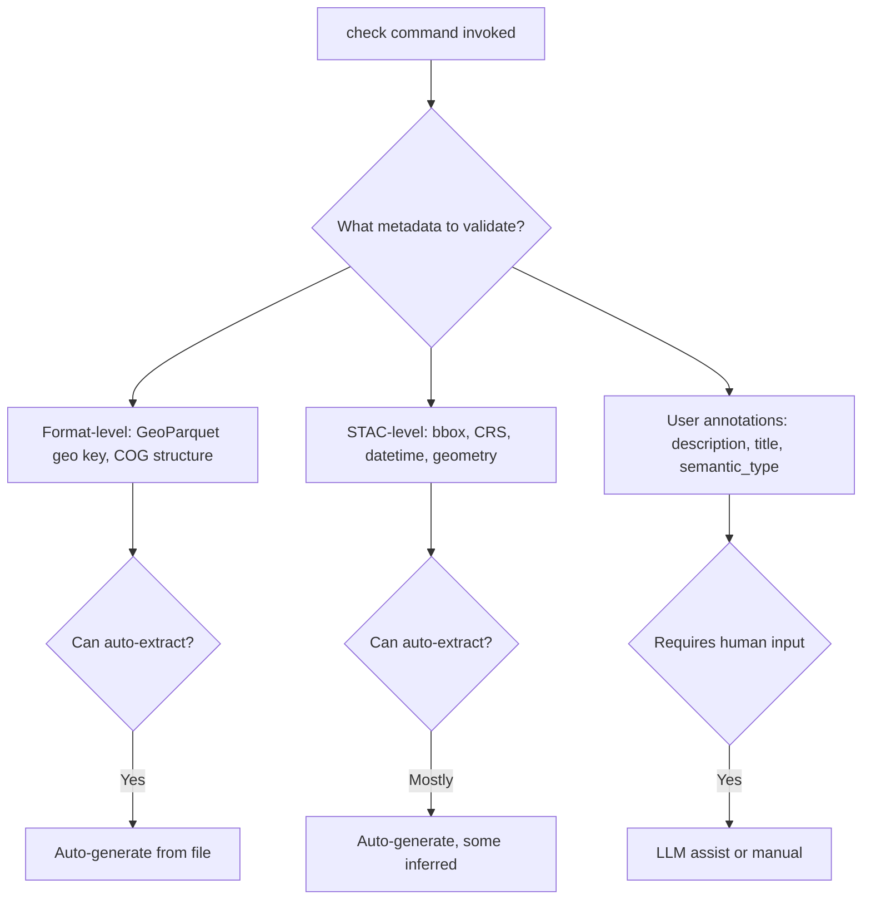
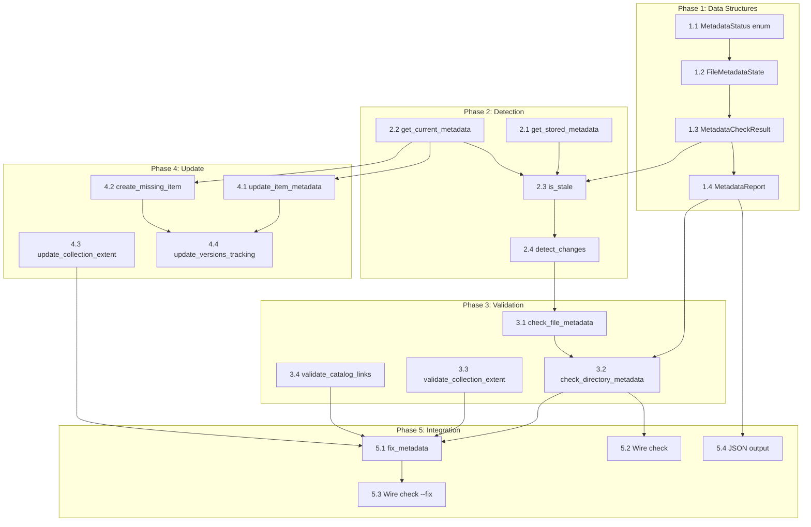

# Scope: check-metadata-handling

**Date:** 2026-02-19
**Status:** ✅ Scope Complete — Ready for Implementation

## Current Focus
> Research complete. Beginning Socratic decomposition of metadata handling requirements.

---

## Research Summary

### Codebase Context

**The `check` Command Today** (`portolan_cli/check.py`):
- Scans directories for geospatial files using `CHECK_EXTENSIONS`
- Classifies files by cloud-native status (`CLOUD_NATIVE`, `CONVERTIBLE`, `UNSUPPORTED`)
- With `--fix`, converts convertible files to cloud-native formats
- Returns `CheckReport` with file counts and optional `ConversionReport`

**What Check Does NOT Do Yet:**
- ❌ Extract metadata from files
- ❌ Validate metadata completeness
- ❌ Report metadata quality issues

**Existing Metadata Infrastructure:**

| Module | What It Does |
|--------|--------------|
| `metadata/geoparquet.py` | `extract_geoparquet_metadata()` → `GeoParquetMetadata` dataclass with `to_dict()`, `to_stac_properties()` |
| `metadata/cog.py` | `extract_cog_metadata()` → `COGMetadata` dataclass with `to_dict()`, `to_stac_properties()` |
| `validation/results.py` | `ValidationResult` with `Severity.ERROR/WARNING/INFO`, `ValidationReport` with pass/fail logic |
| `validation/rules.py` | `ValidationRule` ABC with `check()` method, `DEFAULT_RULES` for catalog structure |
| `models/schema.py` | `SchemaModel` with `ColumnSchema`/`BandSchema` distinguishing auto-extracted vs user-editable |
| `output.py` | `success()`, `info()`, `warn()`, `error()`, `detail()` with consistent formatting |

**Key Architectural Constraints:**
- **ADR-0010**: Delegate validation to upstream (geoparquet-io, rio-cogeo)—don't reimplement
- **ADR-0011**: v0.4 validates catalog structure only; dataset metadata deferred to v0.5+
- **ADR-0016**: Scan-before-import pattern (like ruff check/fix)

**Touch Points:**
- `FileStatus` dataclass could add optional metadata field
- `CheckReport.to_dict()` could include metadata summary
- New rules like `DatasetMetadataRule()` could use existing validation framework

### Domain Research

**External References:**
- [portolan-spec](https://github.com/portolan-sdi/portolan-spec) — Portolan's specification (ground truth for conflicts)
- [stac-spec](https://github.com/radiantearth/stac-spec) — STAC specification
- [GeoParquet spec](https://github.com/opengeospatial/geoparquet)
- [rio-cogeo](https://github.com/cogeotiff/rio-cogeo)

**STAC Validation (Two-Tier Pattern):**
1. **stac-validator**: Schema validation only (spec compliance)
2. **stac-check**: Schema + best practices linting

Key checks from stac-check:
- Searchable identifiers (lowercase, no special chars)
- Geometry presence, null datetime handling
- Self-link in links (strongly recommended)
- Thumbnail file size limits

**GeoParquet Metadata:**

| Field | Required? | Notes |
|-------|-----------|-------|
| `version` | REQUIRED | GeoParquet spec version |
| `primary_column` | REQUIRED | Name of primary geometry column |
| `columns` | REQUIRED | Object with per-column metadata |
| `encoding` | REQUIRED (per column) | e.g., "WKB" |
| `geometry_types` | REQUIRED (per column) | Array of types or empty |
| `crs` | OPTIONAL | PROJJSON; defaults to OGC:CRS84 |
| `bbox` | OPTIONAL | RFC 7946 bounding box |

Forward compatibility: Implementations SHOULD NOT reject unknown fields.

**COG Validation (rio-cogeo):**
- `cog_validate()` returns `(is_valid, errors, warnings)`
- Required: proper tiling (512×512 for >512px files), internal overviews, header ordering
- Recommended: DEFLATE compression

**CLI UX Patterns (ruff, terraform, eslint):**
- **Scan-before-fix**: `check` then `check --fix`
- **Safe vs unsafe fixes**: Safe fixes auto-apply; unsafe require opt-in
- **Severity tiers**: Error (blocks), Warning (recommend), Info (suggest)
- **Output formats**: Human-readable default, `--format json` for machines
- **Exit codes**: 0=success, 1=errors, 2=config errors (or warnings with `--error-on-warning`)

---

## Decision Tree



## Metadata Hierarchy (from PR #78 — merged 2026-02-15)

**Key modules from PR #78:**
- `portolan_cli/models/` — STAC-compliant dataclasses (CatalogModel, CollectionModel, ItemModel, SchemaModel)
- `portolan_cli/collection.py` — `create_collection()`, `write_collection_json()`, `write_schema_json()`
- `portolan_cli/item.py` — `create_item()`, `write_item_json()`
- `portolan_cli/schema/breaking.py` — `detect_breaking_changes()`, `is_breaking()`
- `portolan_cli/metadata/geoparquet.py` — `extract_schema_from_geoparquet()` (returns `SchemaModel`)
- `portolan_cli/metadata/cog.py` — `extract_schema_from_cog()` (returns `SchemaModel`)

### Level 1: Catalog Metadata (`CatalogModel` in `models/catalog.py`)
| Field | Required | Auto-gen? | Notes |
|-------|----------|-----------|-------|
| `id` | Yes | Yes | Directory name |
| `type` | Yes | Yes | Always "Catalog" |
| `stac_version` | Yes | Yes | Hardcoded "1.0.0" |
| `description` | Yes | Yes | Default: "A Portolan-managed STAC catalog" |
| `title` | No | Heuristic | Directory name fallback |
| `links` | Yes | Yes | Self, root, children |
| `created` | Extension | Yes | UTC timestamp |
| `updated` | Extension | Yes | UTC timestamp |

### Level 2: Collection Metadata (`CollectionModel` in `models/collection.py`)
| Field | Required | Auto-gen? | Notes |
|-------|----------|-----------|-------|
| `id` | Yes | Yes | Directory name |
| `type` | Yes | Yes | Always "Collection" |
| `stac_version` | Yes | Yes | Hardcoded "1.0.0" |
| `description` | Yes | Yes | Default: `f"Collection: {collection_id}"` |
| `license` | Yes | Yes | Default: `"CC-BY-4.0"` |
| `extent.spatial.bbox` | Yes | Yes | From `_extract_extent_from_file()` |
| `extent.temporal.interval` | Yes | Yes | `[[created_timestamp, None]]` |
| `title` | No | Heuristic | Optional |
| `providers` | No | **No** | User-provided |
| `summaries` | No | Yes | Aggregated from items |
| `created` | Extension | Yes | UTC timestamp |
| `updated` | Extension | Yes | UTC timestamp |

**Helper classes:** `Provider`, `SpatialExtent`, `TemporalExtent`, `ExtentModel`

### Level 3: Item Metadata (`ItemModel` in `models/item.py`)
| Field | Required | Auto-gen? | Notes |
|-------|----------|-----------|-------|
| `id` | Yes | Yes | Filename stem |
| `type` | Yes | Yes | Always "Feature" |
| `stac_version` | Yes | Yes | Hardcoded "1.0.0" |
| `geometry` | Yes | Yes | From `_extract_geometry_from_file()` |
| `bbox` | Yes | Yes | From `_extract_geometry_from_file()` |
| `properties.datetime` | Yes | Yes | UTC timestamp at creation |
| `assets` | Yes | Yes | Auto-generated from file |
| `collection` | Yes | Yes | Parent collection ID |
| `links` | Yes | Yes | Self, parent, root |
| `title` | No | Heuristic | Optional |
| `description` | No | **No** | User-provided |

### Level 4: Asset Metadata (`AssetModel` in `models/item.py` + `versions.py`)
| Field | Required | Auto-gen? | Notes |
|-------|----------|-----------|-------|
| `href` | Yes | Yes | Relative path (filename) |
| `type` | Yes | Yes | MIME type from `_get_media_type()` |
| `roles` | Yes | Yes | `["data"]` |
| `title` | No | Yes | "Data file" |
| `sha256` | Yes (versions.json) | Yes | Content hash |
| `size_bytes` | Yes (versions.json) | Yes | File size |
| `source_path` | No | Yes | Original pre-conversion file |
| `source_mtime` | No | Yes | **Change detection** (MVP) |

### Level 5: Embedded File Metadata (`GeoParquetMetadata`, `COGMetadata`)
| Field | Required | Auto-gen? | Notes |
|-------|----------|-----------|-------|
| `bbox` | Optional | Yes | From geometry bounds |
| `crs` | Optional | Yes | PROJJSON or OGC:CRS84 default |
| `geometry_type` | Required | Yes | Point, Polygon, etc. |
| `geometry_column` | Required | Yes | Primary column name |
| `feature_count` | N/A | Yes | Row count |
| `schema` | N/A | Yes | Dict of column→type |
| `width/height/band_count` | COG | Yes | COG dimensions |
| `dtype/nodata/resolution` | COG | Yes | COG band info |

### Level 6: Schema Metadata (`SchemaModel` in `models/schema.py`)

**Extracted via:** `extract_schema_from_geoparquet()` or `extract_schema_from_cog()`

| Field | Required | Auto-gen? | Notes |
|-------|----------|-----------|-------|
| `schema_version` | Yes | Yes | Semver (e.g., "1.0.0") |
| `format` | Yes | Yes | "geoparquet" or "cog" |
| `columns` | Yes | Yes | List of `ColumnSchema` or `BandSchema` |
| `crs` | No | Yes | CRS for the schema |
| `statistics` | No | Future | Column statistics |

**ColumnSchema (GeoParquet):**
| Field | Auto-gen? | Notes |
|-------|-----------|-------|
| `name` | Yes | Column name |
| `type` | Yes | Arrow data type string |
| `nullable` | Yes | Boolean |
| `geometry_type` | Yes | For geometry columns |
| `crs` | Yes | EPSG code for geometry columns |
| `description` | **No** | User-editable |
| `unit` | **No** | User-editable |
| `semantic_type` | **No** | User-editable (controlled vocab) |

**BandSchema (COG):**
| Field | Auto-gen? | Notes |
|-------|-----------|-------|
| `name` | Yes | Band name/index |
| `data_type` | Yes | Rasterio dtype |
| `nodata` | Yes | Nodata value |
| `description` | **No** | User-editable |
| `unit` | **No** | User-editable |

### Breaking Change Detection (`schema/breaking.py`)

**Already implemented:** `detect_breaking_changes(old_schema, new_schema) -> list[BreakingChange]`

Detects:
- Column/band removal
- Type changes
- Nullable changes (True→False)
- CRS changes
- Geometry type changes

**Used by:** Schema evolution tracking in versions.json

---

## Change Detection Strategy

### Context: Single-User Git-Style Sync Model

Local catalog tracks remote S3 bucket. Need to detect:
1. **Local edits** — User modified a file after last check
2. **Remote changes** — Remote was updated (by another process/user)
3. **Metadata drift** — STAC metadata doesn't match file contents

### Options Analysis

#### Option 1: MTIME Only

**How it works:**
- Store `source_mtime` in versions.json
- Compare `stat().st_mtime` vs stored value
- Changed = stale

**Pros:**
- Extremely fast (single `stat()` syscall)
- No I/O beyond filesystem metadata
- Works offline
- Simple to implement

**Cons:**
- MTIME can lie:
  - `touch` updates mtime without content change
  - File copy may preserve or reset mtime depending on tool
  - Git checkout resets mtime to checkout time
  - S3 sync tools handle mtime inconsistently
- Network filesystems may have clock skew
- Doesn't detect content-identical re-uploads

**Best for:** Fast local iteration, development workflows

---

#### Option 2: Content Hash (SHA256)

**How it works:**
- Store `sha256` of file content in versions.json (already exists!)
- Recompute hash, compare to stored
- Changed = different hash

**Pros:**
- Cryptographically reliable — if hash matches, content is identical
- Handles all edge cases (touch, copy, clock skew)
- Already stored in versions.json for assets
- S3 ETags are often MD5/SHA256 (can compare without download)

**Cons:**
- **Expensive** — must read entire file to compute hash
- 100GB file @ 500MB/s = 200 seconds
- Network storage = download entire file
- Scales poorly with file count and size

**Best for:** Final verification before publish, CI pipelines with caching

---

#### Option 3: MTIME + Heuristic Fallback

**How it works:**
1. Check mtime first (fast gate)
2. If mtime changed → extract metadata (still fast, O(1))
3. Compare bbox + feature_count/dimensions
4. If heuristics unchanged → "touched but not modified"
5. If heuristics changed → "content changed"

**Pros:**
- Fast path for unchanged files (mtime gate)
- Catches most real changes without full hash
- Metadata extraction is O(1) regardless of file size
- Good signal-to-noise ratio

**Cons:**
- Edge case: data changes within same bbox/count (e.g., attribute edits)
- Requires metadata read (5-50ms) for changed files
- More complex implementation

**Best for:** Balanced approach for local + CI workflows

---

#### Option 4: MTIME + Size

**How it works:**
- Store `source_mtime` AND `size_bytes` (already in versions.json)
- File changed = mtime changed OR size changed

**Pros:**
- Nearly as fast as mtime-only (one extra stat field)
- Catches additions/deletions that change size
- Very simple

**Cons:**
- Size can stay same while content changes (rare but possible)
- Still vulnerable to mtime lies

**Best for:** Quick sanity check, combine with other approaches

---

#### Option 5: Git-Style Object Store

**How it works:**
- Content-addressed storage (like `.git/objects`)
- Store files by SHA256 hash
- "Changed" = new hash not in store

**Pros:**
- Deduplication built-in
- Push/pull semantics map directly
- Can diff local vs remote by comparing object sets

**Cons:**
- Major architectural change
- Doubles storage (original + object store) or requires object store as primary
- Complexity of garbage collection
- Overkill for MVP

**Best for:** Enterprise scale, multi-user collaboration (future portolake?)

---

### Recommendation

**For MVP: Option 3 (MTIME + Heuristic Fallback)**

**Confidence: 7/10**

**Rationale:**

1. **MTIME gate gives speed** — Most files unchanged, skip expensive work
2. **Heuristic catches real changes** — bbox/count/dimensions change when data changes
3. **O(1) metadata reads** — Parquet footer / TIFF IFD, scales to 100GB files
4. **Already have the pieces** — `extract_*_metadata()` exists, just wire it up
5. **Git-style sync compatible** — When you implement push/pull:
   - `pull`: Update local mtime + metadata from remote
   - `push`: Compare local metadata vs remote, upload changed files
   - Heuristics help detect "pull needed" vs "push needed"

**Why not pure hash?** Too slow for interactive use. A 1000-file catalog with 10GB average = hours to hash.

**Why not MTIME-only?** Too unreliable for S3 sync scenarios where mtime handling varies.

**The hybrid approach:**
```
stat() → mtime changed?
    NO  → skip (fast path)
    YES → extract metadata → heuristics changed?
              NO  → warn "file touched, metadata unchanged"
              YES → flag for update
```

**For push/pull (future):**
- Remote has its own versions.json with hashes
- Compare local hash vs remote hash (no recompute needed)
- Only download/upload when hashes differ
- S3 ETag comparison can avoid full downloads

---

### What I'm Less Confident About (why 7 not 9)

1. **S3 ETag behavior** — Not always content hash (multipart uploads use different algo)
2. **Edge case: attribute-only edits** — Changing a column value without changing bbox/count would be missed by heuristics
3. **Multi-user conflicts** — Git-style merge isn't trivial for geospatial data

For the edge cases, the escape hatch is `--force-rehash` flag that does full SHA256 verification. But that's opt-in, not default.

---

## Performance Analysis

### Current Metadata Extraction Cost

| Format | Operation | What's Read | Time Complexity |
|--------|-----------|-------------|-----------------|
| GeoParquet | `pq.ParquetFile(path)` | Footer only (8 bytes → footer size → footer) | **O(1)** |
| COG | `rasterio.open(path)` | TIFF IFDs/headers only | **O(1)** |

**Both are already optimized for 100GB+ files.** No row/pixel data loaded.

### Proposed Tiered Validation (Fast Path)

```
Tier 0: MTIME check (fastest)
    │
    │ stat() call only - microseconds
    │
    ├─ mtime unchanged → SKIP (file not modified)
    │
    └─ mtime changed → Tier 1
            │
Tier 1: Quick heuristics (fast)
    │
    │ Metadata-only read - milliseconds per file
    │
    ├─ bbox unchanged + count unchanged → WARN "file touched but data unchanged"
    │
    └─ bbox OR count changed → Tier 2
            │
Tier 2: Schema diff (still fast)
    │
    │ Compare schema fingerprint
    │
    ├─ Schema unchanged → WARN "data changed, schema stable"
    │
    └─ Schema changed → ERROR "breaking change detected"
```

### Cost Breakdown for 1000-File Catalog

| Tier | Per-File Cost | 1000 Files | Notes |
|------|---------------|------------|-------|
| Tier 0 (mtime) | ~1μs | ~1ms | Just `stat()` |
| Tier 1 (heuristics) | ~5-50ms | 5-50s | Parquet footer / TIFF IFD |
| Tier 2 (schema) | ~same | ~same | Already have metadata from Tier 1 |
| Full hash (sha256) | ~100ms/GB | 100s of hours | **Avoid unless necessary** |

### Key Insight: MTIME as Gate

If we check mtime **first**, most files skip all expensive work:
- Developer iterating: only changed files get deeper checks
- CI pipeline: full catalog, but most files unchanged between runs
- Re-publish: only new/modified files trigger validation

### Network Storage Consideration

For S3/GCS-backed catalogs:
- `stat()` equivalent is HEAD request (~50-100ms)
- Metadata read is range request (~100-200ms)
- Still O(1) per file, but latency-bound not CPU-bound
- **Parallelization** becomes critical (concurrent HEAD requests)

---

## Generation Tiers

### Tier 1: Auto-Extractable (from file bytes)
- `bbox`, `crs`, `geometry_type`, `feature_count`
- `width`, `height`, `band_count`, `dtype`, `nodata`, `resolution`
- `schema` (column names/types)
- `sha256`, `size_bytes`

### Tier 2: Derivable/Inferrable (heuristics)
- `datetime` → File mtime, filename parsing (e.g., `2024-01-15_imagery.tif`)
- `title` → Filename stem, directory name
- `extent.spatial` → Union of child bboxes
- `extent.temporal` → Min/max of child datetimes

### Tier 3: Auto-Derivable with Defaults (from PR #78)

| Field | Default | Source |
|-------|---------|--------|
| Catalog `description` | `"A Portolan-managed STAC catalog"` | `catalog.py:197` |
| Catalog `title` | None (warns if missing) | `catalog.py:200-201` |
| Collection `description` | Param required, but could default | `collection.py:create_collection()` |
| Collection `license` | `"CC-BY-4.0"` | `collection.py:29` |
| Collection `extent.spatial` | Extracted from data file | `collection.py:_extract_extent_from_file()` |
| Collection `extent.temporal` | `[[created_timestamp, None]]` | Open-ended interval |
| Item `datetime` | `datetime.now(timezone.utc)` | `item.py:51` |
| Item `geometry` | Extracted from data file | `item.py:_extract_geometry_from_file()` |
| Item `bbox` | Extracted from data file | `item.py:_extract_geometry_from_file()` |
| Item `title`, `description` | None (optional) | `item.py:create_item()` |
| Asset `type` | MIME type from extension | `item.py:_get_media_type()` |
| Asset `roles` | `["data"]` | `item.py:59` |
| Schema `schema_version` | `"1.0.0"` | Hardcoded in extraction |

**Note:** `stac.py:23` still has stale `DEFAULT_LICENSE = "proprietary"` — this should be fixed to align with `collection.py`.

### Tier 4: Human-Enrichable (optional, never required)
- `semantic_type` → Controlled vocabulary (user adds if they want)
- `unit` → Per-column units (user adds if they want)
- `providers` → Organization info (user adds if they want)
- Custom titles/descriptions → Override auto-derived defaults

## Task Decomposition

### Phase 1: Core Data Structures

| Task | Description | Output |
|------|-------------|--------|
| 1.1 | Define `MetadataStatus` enum | `MISSING`, `FRESH`, `STALE`, `BREAKING` |
| 1.2 | Define `FileMetadataState` dataclass | Holds current vs stored metadata for comparison |
| 1.3 | Define `MetadataCheckResult` dataclass | Per-file result with status, changes detected, fix hints |
| 1.4 | Define `MetadataReport` dataclass | Aggregate report with counts, lists of issues |

### Phase 2: Detection Functions

| Task | Description | Output |
|------|-------------|--------|
| 2.1 | `get_stored_metadata(path)` | Read existing STAC item + versions.json for a file |
| 2.2 | `get_current_metadata(path)` | Extract fresh metadata from file (reuse existing extractors) |
| 2.3 | `is_stale(stored, current)` | MTIME check + heuristic fallback (bbox, count, schema) |
| 2.4 | `detect_changes(stored, current)` | Return list of what changed (bbox, schema, etc.) |

### Phase 3: Validation Functions

| Task | Description | Output |
|------|-------------|--------|
| 3.1 | `check_file_metadata(path)` | Return `MetadataCheckResult` for single file |
| 3.2 | `check_directory_metadata(path)` | Return `MetadataReport` for directory tree |
| 3.3 | `validate_collection_extent(collection, items)` | Check extent contains all item bboxes |
| 3.4 | `validate_catalog_links(catalog)` | Check links are valid |

### Phase 4: Update Functions

| Task | Description | Output |
|------|-------------|--------|
| 4.1 | `update_item_metadata(item_path, file_path)` | Re-extract and update existing item |
| 4.2 | `create_missing_item(file_path)` | Create new item for file without STAC metadata |
| 4.3 | `update_collection_extent(collection_path)` | Recalculate extent from child items |
| 4.4 | `update_versions_tracking(file_path)` | Update source_mtime in versions.json |

### Phase 5: Integration

| Task | Description | Output |
|------|-------------|--------|
| 5.1 | `fix_metadata(path, report)` | Apply fixes for all issues in report |
| 5.2 | Wire into `check` command | Add metadata validation to check flow |
| 5.3 | Wire into `check --fix` | Call `fix_metadata()` when --fix passed |
| 5.4 | Add JSON output support | MetadataReport.to_dict() for --json |

## Dependency Order



**Critical path:** 1.1 → 1.2 → 1.3 → 2.3 → 3.1 → 3.2 → 5.2 (read-only check)

**Fix path:** 3.2 → 4.1/4.2 → 4.3 → 4.4 → 5.1 → 5.3

## Happy Path

### Scenario: Fresh catalog, no changes

```bash
$ portolan check ./my-catalog

→ Checking metadata for 47 files...
✓ 47 files have valid metadata
✓ All collection extents consistent
✓ Catalog links valid

0 issues found
```

### Scenario: Some files modified locally

```bash
$ portolan check ./my-catalog

→ Checking metadata for 47 files...
⚠ 3 files have stale metadata:
    parcels.parquet (mtime changed, bbox unchanged)
    buildings.parquet (mtime changed, schema changed)
    imagery.tif (mtime changed, dimensions changed)

⚠ 1 collection extent outdated:
    census/ (item bbox outside collection extent)

3 warnings, 0 errors
Run 'portolan check --fix' to regenerate metadata
```

### Scenario: New files without metadata

```bash
$ portolan check ./my-catalog

→ Checking metadata for 50 files...
✗ 3 files missing STAC metadata:
    new_data.parquet
    another_file.parquet
    new_image.tif

3 errors
Run 'portolan check --fix' to create missing metadata
```

### Scenario: check --fix

```bash
$ portolan check --fix ./my-catalog

→ Checking metadata for 50 files...
→ Fixing 6 issues...
  ✓ Created item for new_data.parquet
  ✓ Created item for another_file.parquet
  ✓ Created item for new_image.tif
  ✓ Updated item for parcels.parquet
  ✓ Updated item for buildings.parquet (⚠ breaking schema change)
  ✓ Updated item for imagery.tif
  ✓ Updated collection extent for census/

6 issues fixed
✓ All metadata up to date
```

## Edge Cases

| Scenario | Expected Behavior | Notes |
|----------|-------------------|-------|
| File deleted after import | ERROR: "Item references missing file" | Item exists but asset href broken |
| File renamed | ERROR: "Missing metadata" + "Orphan item" | New file needs item; old item is orphan |
| STAC item exists but versions.json missing | WARN: "No version tracking for file" | Can still validate item vs file |
| versions.json exists but no STAC item | ERROR: "Missing STAC item" | versions.json alone insufficient |
| File touched but content identical | INFO: "File touched, no changes detected" | mtime changed, heuristics unchanged |
| Attribute edit (same bbox/count) | MISS (false negative) | Edge case of heuristic approach |
| Schema breaking change | ERROR: "Breaking schema change detected" | Use `detect_breaking_changes()` |
| Collection extent smaller than item bbox | ERROR: "Item bbox outside collection extent" | Must recalculate extent |
| Empty directory | OK (no files to check) | Valid state |
| Mixed formats (GeoParquet + COG) | OK | Each file validated independently |
| Non-geo file in directory | SKIP | Only check GEO_ASSET_EXTENSIONS |
| Corrupt GeoParquet (no geo key) | WARN: "Missing geo metadata" | Valid Parquet but not GeoParquet |
| Corrupt COG (not cloud-optimized) | WARN: "Not cloud-optimized" | Valid TIFF but not COG |
| Permission denied on file | ERROR: "Cannot read file" | Report but continue |
| Very large file (100GB+) | OK (O(1) metadata read) | No performance degradation |
| Network timeout (S3) | ERROR: "Network error" | Retry logic (future) |

## Resolved Assumptions
| Assumption | Decision | Rationale |
|------------|----------|-----------|
| Where does metadata validation live? | Internal `metadata` command orchestrated by `check` | Analogous to how `check` orchestrates internal `convert` command |
| What does `--fix` do for metadata? | Auto-regenerates all Tier 1 + Tier 2 metadata | Stale mtime → re-extract bbox, count, schema; recalculate extents |
| Human-required fields? | **None** — all fields auto-derivable | description/title/license have sensible defaults; user can enrich but never required |
| Config/defaults system? | **Parking lot** — separate ticket | Compression, naming, overwrites configurable per catalog/collection |
| Change detection strategy? | **Option 3: MTIME + Heuristics** (confidence 7/10) | Fast mtime gate → O(1) metadata read → bbox/count/schema diff |

## Open Questions (All Resolved)

1. ~~What triggers metadata validation?~~ → `check` command, internal `metadata` module
2. ~~What's the unit of work?~~ → Directory tree (recursive); supports single file via path
3. ~~What constitutes success?~~ → All files have STAC items, all items are fresh, extents consistent
4. ~~Who is the primary user?~~ → Local gov/municipal employee iterating; CI pipeline; end-user publishing
5. ~~What's the failure mode?~~ → Warn and continue; report all issues; `--fix` to remediate

## Key Questions (from user)
- **Existence**: Do metadata exist? All? Some?
- **Validity**: Are they valid? Up to date?
- **Efficiency**: Most efficient way to parse/validate?
- **Auto-generation**: What can be auto-generated? What can't?
- **Generation tiers**: Auto vs LLM vs manual?
- **Change detection**: If file edited locally, how to update metadata?

## Command Workflow (Clarified)

```
init → scan --fix → check --fix → push/pull
                ↑
              sync (orchestrates all of the above)
```

| Command | Responsibility |
|---------|----------------|
| `init` | Create catalog structure |
| `scan --fix` | Validate directory structure + convert to cloud-native formats |
| `check --fix` | Validate metadata + regenerate stale metadata |
| `push/pull` | Sync with remote storage |
| `sync` | Orchestration command — runs the full pipeline |

**Metadata validation lives in `check`**, not `sync`. `sync` just calls `check --fix` as part of its pipeline.

---

## Architecture: `check` Orchestrates Internal Commands

**Pattern (like `convert`):**

```
check command
    │
    ├── convert (internal) ← already exists
    │   └── Format conversion: GeoJSON → GeoParquet, TIFF → COG
    │
    └── metadata (internal) ← THIS IS WHAT WE'RE BUILDING
        └── Metadata generation: extract → validate → create/update STAC
```

**`check` can operate on a raw directory** (no `catalog.json` required).

**What the `metadata` internal command does:**
1. Scan directory for geo-assets (GeoParquet, COG)
2. For each asset:
   - Extract metadata from file (bbox, CRS, schema, etc.)
   - Check if STAC item exists
   - If missing → create STAC item
   - If exists but stale (mtime changed) → update STAC item
3. Update collection extents (union of item bboxes)
4. Update versions.json with source_mtime

**`check` (read-only):** Reports what's missing/stale
**`check --fix`:** Calls `metadata` internal command to create/update

---

## What Already Exists (from PR #78)

PR #78 (merged 2026-02-15) implemented the **creation** side of STAC metadata. The `metadata` internal command we're building is the **validation + update** side.

### Already Implemented ✅

| Function | Module | Purpose |
|----------|--------|---------|
| `create_collection()` | `collection.py` | Create `CollectionModel` from data file |
| `create_item()` | `item.py` | Create `ItemModel` from data file |
| `write_collection_json()` | `collection.py` | Write collection to JSON |
| `write_item_json()` | `item.py` | Write item to JSON |
| `write_schema_json()` | `collection.py` | Write schema sidecar |
| `extract_geoparquet_metadata()` | `metadata/geoparquet.py` | Extract `GeoParquetMetadata` |
| `extract_cog_metadata()` | `metadata/cog.py` | Extract `COGMetadata` |
| `extract_schema_from_geoparquet()` | `metadata/geoparquet.py` | Extract `SchemaModel` |
| `extract_schema_from_cog()` | `metadata/cog.py` | Extract `SchemaModel` |
| `detect_breaking_changes()` | `schema/breaking.py` | Compare schemas for breaking changes |
| `read_collection_json()` | `collection.py` | Read existing collection |
| `read_item_json()` | `item.py` | Read existing item |

### Needs Building 🔨

| Function | Module | Purpose |
|----------|--------|---------|
| `check_metadata()` | `metadata.py` (new) | Validate metadata freshness + completeness |
| `update_item()` | `item.py` or `metadata.py` | Update existing item from file |
| `update_collection_extent()` | `collection.py` or `metadata.py` | Recalculate extent from items |
| `is_stale()` | `metadata.py` (new) | Compare mtime + heuristics |
| `MetadataReport` | `metadata.py` (new) | Report of what's missing/stale |
| `fix_metadata()` | `metadata.py` (new) | Regenerate stale metadata |

### Key Insight: Creation vs. Update

PR #78 handles **initial creation** — when there's no existing STAC metadata.

What we're building handles:
1. **Detection** — Does metadata exist? Is it fresh?
2. **Validation** — Does it match the file?
3. **Update** — Regenerate if stale

## Parking Lot
- **Config/defaults system**: Allow sophisticated users to override baked-in defaults (compression, naming, overwrites) at catalog/collection/asset level. Separate ticket.
- **LLM-assisted descriptions**: Draft descriptions from filenames/schema. Future enhancement.
- **Network storage parallelization**: Concurrent HEAD requests for S3/GCS. Future optimization.
- **`--force-rehash` flag**: Full SHA256 verification for edge cases where heuristics miss changes.

---

## Summary

### What We're Building

An internal `metadata` module (analogous to `convert`) that:
1. **Detects** missing/stale STAC metadata for geo-assets
2. **Validates** metadata consistency (item ↔ file, collection extent ↔ items)
3. **Fixes** issues by regenerating metadata from files

### Key Decisions

| Decision | Choice | Rationale |
|----------|--------|-----------|
| Where | Internal module orchestrated by `check` | Pattern matches `convert` |
| Change detection | MTIME + heuristics (confidence 7/10) | Fast gate + O(1) metadata reads |
| Human-required fields | None | All fields auto-derivable with sensible defaults |
| Fix behavior | `--fix` regenerates everything automatable | Tier 1 + Tier 2 metadata |
| Workflow | `init → scan --fix → check --fix → push/pull` | `sync` orchestrates all |

### Implementation Order

1. **Data structures** (MetadataStatus, FileMetadataState, MetadataCheckResult, MetadataReport)
2. **Detection** (get_stored_metadata, get_current_metadata, is_stale, detect_changes)
3. **Validation** (check_file_metadata, check_directory_metadata, validate_collection_extent)
4. **Update** (update_item_metadata, create_missing_item, update_collection_extent)
5. **Integration** (fix_metadata, wire into check, JSON output)

### Already Exists (from PR #78)

- STAC models: `CatalogModel`, `CollectionModel`, `ItemModel`, `SchemaModel`
- Creation: `create_collection()`, `create_item()`, `write_*_json()`
- Extraction: `extract_*_metadata()`, `extract_schema_from_*()`
- Breaking change detection: `detect_breaking_changes()`

### Needs Building

- Staleness detection: `is_stale()`, `detect_changes()`
- Validation: `check_file_metadata()`, `check_directory_metadata()`
- Update: `update_item_metadata()`, `update_collection_extent()`
- Integration: `fix_metadata()`, wiring into `check` command
